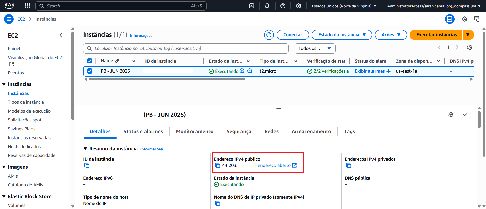
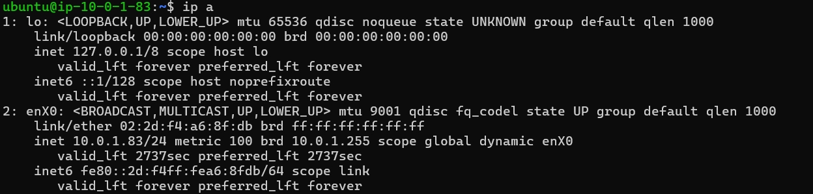
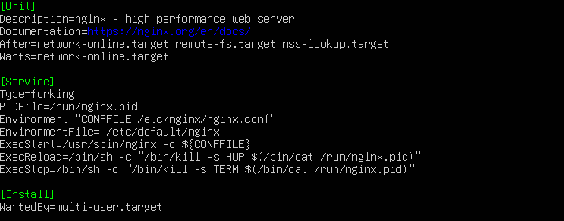
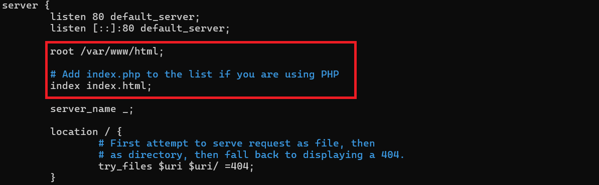
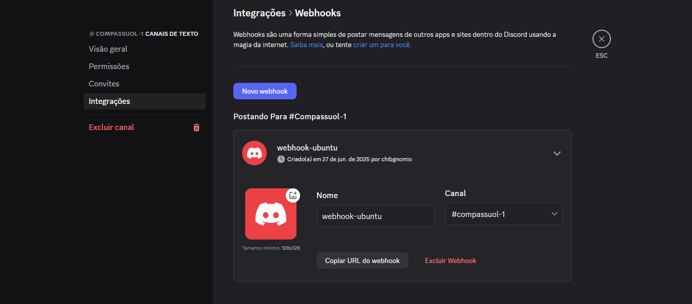

<h1 align="center">Sistema Monitorador de Servidor Web</h1>

<div align="center">
  <strong>🚨 Criado para executar tarefas automatizadas de monitoramento em um servidor web com notificações em tempo real via Discord 🚨</strong>
</div>

</br>

<p align="center">
	
    <a href="https://img.shields.io/github/repo-size/sahyneer/servidor-nginx-ubuntu">
        
    </a>
    
</p>

<p align="center">
    <a href="#-visão-do-projeto">Visão do projeto</a> •
    <a href="#-tecnologias">Tecnologias</a> •
    <a href="#-instruções">Instruções</a> •
    <a href="#-autora">Autora</a>
 </p>


## 🔭 Visão do projeto

<p>O projeto foi desenvolvido durante a 1º Sprint do Programa Compass.Uol Scholarship, que tinha por desafio construir uma instância Amazon EC2 com um servidor Nginx no Ubuntu 24.04 e um sistema de monitoramento e notificação.</p>

<p>O sistema foi configurado para funcionar automaticamente ao ligar a máquina e reiniciar em caso de falha ou interrupção, além de realizar monitoramentos a cada minuto sobre status de funcionamento. Caso o sistema não estiver funcionando, o script envia avisos para um servidor Discord informando a indisponibilidade do servidor, juntamente com data e hora de detecção.</p>


## 💻 Tecnologias

[](https://skillicons.dev)

## ⚙️ Instruções

### Índice

- [Configuração do Ambiente AWS](#configuração-do-ambiente-aws)
- [Configurações Iniciais da VM](#configurações-iniciais-da-vm)

    + [Ativando o Superusuário](#ativando-o-superusuário)

    + [Ajustando Data e Hora](#ajuste-de-data-e-hora)

- [Instalação do Servidor Nginx](#instalação-do-servidor-nginx)

    + [Testando o Servidor Nginx](#testando-o-servidor-nginx)

- [Configurações Gerais do Nginx](#configurações-gerais-do-nginx)

    + [Iniciando o Servidor Automaticamente](#iniciando-o-servidor-automaticamente)

    + [Reiniciando o Servidor em Caso de Interrupção ou Falha](#reiniciando-o-servidor-em-caso-de-interrupção-ou-falha)

    + [Teste de Reinicialização Automática](#teste-de-reinicialização-automatica)

- [Localizando a Página HTML](#localizando-a-página-html)

- [Criando o Ambiente de Webhook no Discord](#criando-o-ambiente-de-webhook-no-discord)

- [Criando o Arquivo .env](#criando-o-arquivo-env)

- [Importando o Script](#importando-o-script)

    + [Script de Monitoramento](#script-de-monitoramento)

- [Funcionamento do Script a Cada Minuto](#funcionamento-do-script-a-cada-minuto)

    + [Comandos Básicos do Cron](#comandos-básicos-do-cron)

    + [Configurando o Cron para o Script](#configurando-o-cron-para-o-script)

### Configuração da Máquina Virtual

#### Ativando o Superusuário

<p>Logo após acessar a VM, é de extrema importância estar logado como super usuário, para que assim as configurações possam ser realizadas sem problemas de permissão. Para entrar como superusuário digite o comando abaixo e logo em seguida a senha definida na instalação do SO:</p>

```bash
sudo su
```

#### Ajustando Data e Hora
Para obter melhores resultados no uso do sistema, as configurações de data e hora precisam estar ajustadas corretamente. Para conferir isso, digite `date`.

Caso não esteja, use o comando `timedatectl` para resolver esse problema. Antes de usá-lo, confira a região geográfica que se encontra a partir da lista gerada pelo seguinte comando:
```bash
timedatectl list-timezone
```
Depois de conferir, digite de acordo com o continente e cidade que deseja alterar:
```bash
timectl set-timezone continente/cidade
```

### Instalação do Servidor Nginx

<p>Antes de qualquer instalação é importante realizar uma atualização da lista de pacotes para evitar erros de instalação:</p>

```bash
apt-get update
```
<p>Após isso podemos realizar a instalação do servidor Nginx:</p>

```bash
apt install nginx
```

<p>Ao longo da instalação, podem ser requisitados confirmação para continuar com a instalação, basta digitar S e a tecla Enter.</p>

Para confirmar se está instalado, use o comando `systemctl status nginx`. Deve mostrar status ativo como na imagem abaixo:


</br>

#### Testando o Servidor Nginx

Digite o ip público da EC2 no navegador, caso apareça o site, o Nginx está funcionando corretamente. O ip pode ser encontrado na página que contém informações da instância ao inicia-la:



Em casos de aplicação em VM local, execute o comando `ip a` para saber o ip local:



### Configurações Gerais do Nginx

O `systemd` é o sistema de inicialização padrão das distribuições modernas do Linux, responsável por inicializar o sistema, gerenciar serviços e processos em segundo plano. 

Para controlar os serviços do `systemd` usa-se o comando `systemctl`, e com ele que as principais tarefas de configuração e análise do servidor podem ser executadas.

</br>

#### Iniciando o servidor automaticamente

Normalmente após a instalação do Nginx, o servidor é automaticamente configurado para iniciar justamente com o boot do sistema. É possível conferir isso, executando o comando `systemctl is-enabled nginx`. O resultado esperado é `enabled`.

Caso não seja esse o caso, use o comando ``systemctl enable nginx`` para ativar e confira o status novamente com o `systemctl is-enabled nginx`.

</br>

#### Reiniciando o servidor em caso de interrupção ou falha
 
 Para essa configuração é necessário acessar o arquivo que controla o serviço do Nginx:


```bash
/etc/systemd/system/multi-user.target.wants/nginx.service
```

> O caminho mostrado acima trata-se de um link simbólico para o arquivo real, que depende de cada distribuição e versão do SO. Os caminhos normalmente são /lib/systemd/system/nginx.service ou /etc/systemd/system/nginx.service. Para saber o real caminho execute ls -l /etc/systemd/system/multi-user.target.wants/nginx.service.

Ao abrir o arquivo, tem por `default` algumas configurações do Nginx, como mostrado abaixo:



Para fazer a modificação do documento, use o `nano`, `vi`, ou qualquer outro editor, e acrescente em `service` as seguintes linhas:

```bash
Restart=always # reiniciar sempre que parar
RestartSec=10 # reinicia após 10 segundos
```

Após salvar as modificações, execute os seguintes comandos:
```bash
systemctl daemon-reload # recarregar novas configurações
systemctl restart nginx # reiniciar o servidor
systemctl status nginx # verificar status de funcionamento
```

#### Teste de Reinicialização Automática

Caso deseje testar o funcionamento desta configuração, podemos simular uma interrupção brusca no servidor ao forçar a finalização do processo em execução. Use o seguinte comando:

```bash
kill -9 $(pidof nginx)
```

Após 10 segundos execute o comando `systemctl status nginx` para verificar o status do servidor e verá a seguinte informação:


Note abaixo que ocorreu uma falha de conexão com o signal (escrito em laranja) e na linha seguinte, mostra que 10 segundos depois, o Nginx reiniciou automaticamente como definido nas configurações.

### Localizando a Página HTML

A localização do html é definida dentro das configurações do Nginx. No Ubuntu em específico, o arquivo pode ser encontrado no caminho `/etc/nginx/sites-available/default`.

> Em algumas distribuições pode estar localizado em /etc/nginx/conf.d/default.conf

Dentro do arquivo, é preciso procurar `root` no bloco `server`. Abaixo, vemos que o arquivo html está no caminho `/var/www/html` com o nome `index` ou `index.html`



> Lembrando que esse caminho pode mudar de acordo com cada distribuição e versão, por isso é importante verificar primeiro antes de acessar o repositório!

Portanto, para alterar esse arquivo basta ir até o diretório e editar o arquivo ou importar um arquivo.

### Criando o Ambiente de Webhook no Discord

Antes de gerenciar o recurso, é preciso ter criado um servidor e um canal de texto

#### Passso a Passo

1. No servidor, abra a aba de configurações do canal;
2. Selecione a opção "editar canal";
3. No lado esquerdo da tela, selecione "integrações";
4. Selecione a opção "Webhooks";
5. Crie um "Novo Webhook";
6. Copie a URL.

> A URL não pode ser compartilhada publicamente, pois pode ser usada por qualquer pessoa para enviar mensagens. Por isso, será criado um arquivo .env para encriptar os dados de acesso contidos e não deixar exposto no script.



### Criando o Arquivo .env

Dentro do diretório crie o arquivo .env para colocar a URL do Webhook copiada dentro da variável `discordWebhook`:

```bash
discordWebhook="URL"
```

>CUIDADO ao criar esse arquivo, não pode conter espaços antes, dentro e/ou depois da linha de código. Caso o contrário o script não será capaz de detectar corretamente o conteúdo do arquivo .env!

### Importando o Script

O script, escrito em bash, tem a função de verificar as requisições http e enviar logs de status do servidor, além de enviar um aviso via webhook do Discord em caso de status Offline.

Para isso, basta importar este repositório no diretório raíz:

```bash
git clone https://github.com/sahyneer/monitora-servidor-web.git
```

#### Script de Monitoramento

```bash
#!/bin/bash

. /monitora-servidor-web/.env

URL=$(hostname -I)

requisicaoHTTP=$(curl -Is $URL | head -n 1)

# Definição de cores para melhor visualização dos logs
fonteVermelho='\033[0;31m'
fonteVerde='\033[0;32m'
fonteSemCor='\033[0m' # reset de cor

formatacaoData=$(date "+%Y/%m/%d %H:%M:%S")

if [ "$requisicaoHTTP" ]; then
  printf "${fonteVerde}${formatacaoData} Servidor Online ($URL)${fonteSemCor}\n"
else
  printf "${fonteVermelho}${formatacaoData} Servidor Offline ($URL)${fonteSemCor}\n"
  # Envio da mensagem para o Discord e ocultacao de saida do curl para o log
  curl -H "Content-Type: application/json" \
       -X POST \
       -d "{\"content\": \"🔴 [$formatacaoData] - **Servidor Offline**\"}" \
       "$discordWebhook" > /dev/null 2>&1
fi
```

É necessário tornar o script executável, para isso, dentro do diretório do arquivos, digite o comando:

```bash
chmod +x script_verifica.sh
```

### Funcionamento do Script a Cada Minuto

O cron é um agendador de tarefas do sistema que permite executar comandos ou scripts automaticamente em horários ou intervalos regulares. As definições são feitas dentro do arquivo crontab e devem ser carregadas para funcionar corretamente.

#### Comandos Básicos do Cron

1. Verificar status: `service cron status`
2. Iniciar serviço: `service cron start`
3. Parar serviço: `service cron stop`
4. Listar os todos os cronjobs em funcionamento: `crontab -l`

>É importante destacar que os cronjobs são definidos por usuários, ou seja, se definiu um cronjob com o usuário root, não pode alterar ou listar a menos que esteja logado como usuário root!

#### Configurando o Cron para o Script

Primeiramente, abra o arquivo do crontab para edição como o comando: `crontab -e` e acrescente o seguinte código:

```bash
* * * * * /monitora-servidor-web/script_verifica.sh >> /var/log/monitora.log 2>&1
```
O comando acima está determinando que o script_verifica.sh irá rodar a cada minuto (* * * * *) e sua saída será armazenada no arquivo monitora.log (2>&1) sem sobrepor o que já foi escrito a cada ciclo (>>).

Por fim, pode o comando `service cron start` para carregar as novas configurações do crontab.

## 🧙‍♂️ Autora

<p>Feito com 💛 por Sarah Cabral<p>

<p>Vamos nos conectar?</p>

[](mailto:sahyneer@gmail.com)
[](https://www.linkedin.com/in/sahyneer/)
[](https://github.com/sahyneer)