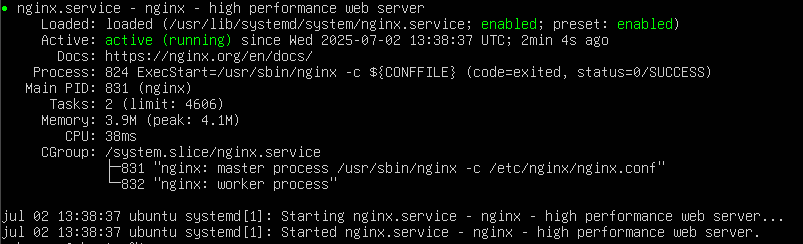
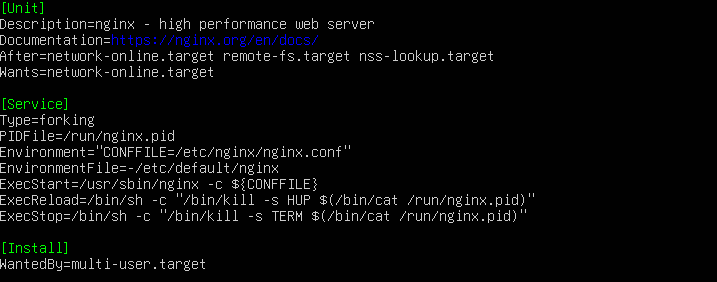
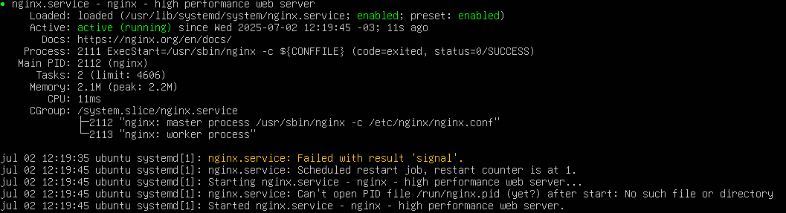

<h1 align="center">Sistema Monitorador de Servidor Web</h1>

<div align="center">
  <strong>🚨 Criado para executar tarefas automatizadas de monitoramento em um servidor web com notificações em tempo real via Discord 🚨</strong>
</div>

</br>

<p align="center">
	
    <a href="https://img.shields.io/github/repo-size/sahyneer/servidor-nginx-ubuntu">
        
    </a>
    
</p>

<p align="center">
    <a href="#-visão-do-projeto">Visão do projeto</a> •
    <a href="#-tecnologias">Tecnologias</a> •
    <a href="#-instruções">Instruções</a> •
    <a href="#-autora">Autora</a>
 </p>


## 🔭 Visão do projeto

<p>O projeto foi desenvolvido durante a 1º Sprint do Programa Compass.Uol Scholarship, que tinha por desafio construir uma instância Amazon EC2 com um servidor Nginx no Ubuntu 24.04 e um sistema de monitoramento e notificação.</p>

<p>O sistema foi configurado para funcionar automaticamente ao ligar a máquina e reiniciar em caso de falha ou interrupção, além de realizar monitoramentos a cada minuto sobre status de funcionamento. Caso o sistema não estiver funcionando, o script envia avisos para um servidor Discord informando a indisponibilidade do servidor, juntamente com data e hora de detecção.</p>


## 💻 Tecnologias

[](https://skillicons.dev)

## ⚙️ Instruções

### Índice

- [Configuração do Ambiente AWS](#configuração-do-ambiente-aws)
- [Configurações Iniciais da VM](#configurações-iniciais-da-vm)

    + [Ativando o Superusuário](#ativando-o-superusuário)

    + [Ajustando Data e Hora](#ajuste-de-data-e-hora)

- [Instalação do Servidor Nginx](#instalação-do-servidor-nginx)

    + [Testando o Servidor Nginx](#testando-o-serividor-nginx)

- [Configurações Gerais do Nginx](#configurações-gerais-do-nginx)

    + [Iniciando o Servidor Automaticamente](#iniciando-o-servidor-automaticamente)

    + [Reiniciando o Servidor em Caso de Interrupção ou Falha](#reiniciando-o-servidor-em-caso-de-interrupção-ou-falha)

    + [Teste de Reinicialização Automática](#teste-de-reinicialização-automatica)


### Configuração da Máquina Virtual

#### Ativando o Superusuário

<p>Logo após acessar a VM, é de extrema importância estar logado como super usuário, para que assim as configurações possam ser realizadas sem problemas de permissão. Para entrar como superusuário digite o comando abaixo e logo em seguida a senha definida na instalação do SO:</p>

```bash
sudo su
```

#### Ajustando Data e Hora
Para obter melhores resultados no uso do sistema, as configurações de data e hora precisam estar ajustadas corretamente. Para conferir isso, digite `date`.

Caso não esteja, use o comando `timedatectl` para resolver esse problema. Antes de usá-lo, confira a região geográfica que se encontra a partir da lista gerada pelo seguinte comando:
```bash
timedatectl list-timezone
```
Depois de conferir, digite de acordo com o continente e cidade que deseja alterar:
```bash
timectl set-timezone continente/cidade
```

### Instalação do Servidor Nginx

<p>Antes de qualquer instalação é importante realizar uma atualização da lista de pacotes para evitar erros de instalação:</p>

```bash
apt-get update
```
<p>Após isso podemos realizar a instalação do servidor Nginx:</p>

```bash
apt install nginx
```

<p>Ao longo da instalação, podem ser requisitados confirmação para continuar com a instalação, basta digitar S e a tecla Enter.</p>

Para confirmar se está instalado, use o comando `systemctl status nginx`. Deve mostrar status ativo como na imagem abaixo:



</br>

#### Testando o Servidor Nginx

Digite o ip público da EC2 no navegador 

### Configurações Gerais do Nginx

O `systemd` é o sistema de inicialização padrão das distribuições modernas do Linux, responsável por inicializar o sistema, gerenciar serviços e processos em segundo plano. 

Para controlar os serviços do `systemd` usa-se o comando `systemctl`, e com ele que as principais tarefas de configuração e análise do servidor podem ser executadas.

</br>

### Iniciando o servidor automaticamente

Normalmente após a instalação do Nginx, o servidor é automaticamente configurado para iniciar justamente com o boot do sistema. É possível conferir isso, executando o comando `systemctl is-enabled nginx`. O resultado esperado é `enabled`.

Caso não seja esse o caso, use o comando ``systemctl enable nginx`` para ativar e confira o status novamente com o `systemctl is-enabled nginx`.

</br>

### Reiniciando o servidor em caso de interrupção ou falha
 
 Para essa configuração é necessário acessar o arquivo que controla o serviço do Nginx:


```bash
/etc/systemd/system/multi-user.target.wants/nginx.service
```

> O caminho mostrado acima trata-se de um link simbólico para o arquivo real, que depende de cada distribuição e versão do SO. Os caminhos normalmente são /lib/systemd/system/nginx.service ou /etc/systemd/system/nginx.service. Para saber o real caminho execute ls -l /etc/systemd/system/multi-user.target.wants/nginx.service.

Ao abrir o arquivo, tem por `default` algumas configurações do Nginx, como mostrado abaixo:



Para fazer a modificação do documento, use o `nano`, `vi`, ou qualquer outro editor, e acrescente em `service` as seguintes linhas:

```bash
Restart=always # reiniciar sempre que parar
RestartSec=10 # reinicia após 10 segundos
```

Após salvar as modificações, execute os seguintes comandos:
```bash
systemctl daemon-reload # recarregar novas configurações
systemctl restart nginx # reiniciar o servidor
systemctl status nginx # verificar status de funcionamento
```

### Teste de Reinicialização Automática

Caso deseje testar o funcionamento desta configuração, podemos simular uma interrupção brusca no servidor ao forçar a finalização do processo em execução. Use o seguinte comando:

```bash
kill -9 $(pidof nginx)
```

Após 10 segundos execute o comando `systemctl status nginx` para verificar o status do servidor e verá a seguinte informação:



Note abaixo que ocorreu uma falha de conexão com o signal (escrito em laranja) e na linha seguinte, mostra que 10 segundos depois, o Nginx reiniciou automaticamente como definido nas configurações.

## 🧙‍♂️ Autora

<p>Feito com 💛 por Sarah Cabral<p>

<p>Vamos nos conectar?</p>

[](mailto:sahyneer@gmail.com)
[](https://www.linkedin.com/in/sahyneer/)
[](https://github.com/sahyneer)